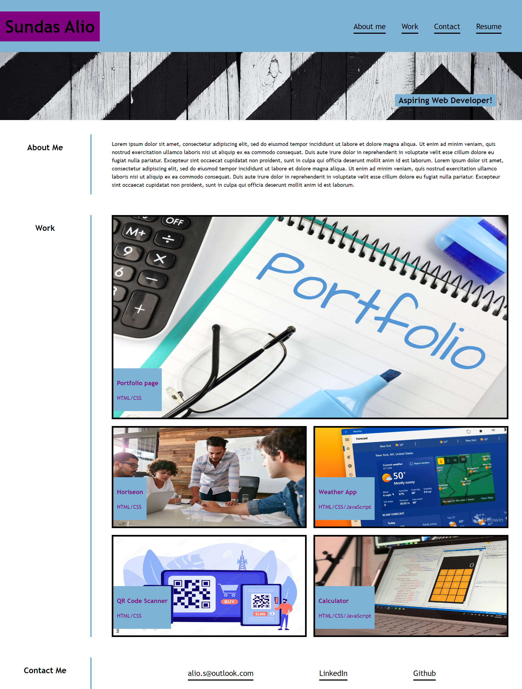

# c2-portfolio-page
## Description

The purpose of this project is  to create  portfolio page that showcases the skills developed as a front-end developer to employers. This challenge excercised the some of the skills recently learned such as, flexbox, grid and media queries to adapt the design/layout to different screens.

## Usage

The deployed application contains my name, a section about me, my works and how to contact me. The work section outlines projects I've worked on and others i would like to complete once I've gained the neccessary skills.

link to deployed application:
https://sunsalio.github.io/c2-portfolio-page/

screenshot of complete portfolio website|:

    ```md
    
    ```

## Credits

Portfolio   image
-Origin: pix4free
-link to image: https://pix4free.org/assets/library/2021-05-25/originals/portfolio.jpg

Weather App image
-Origin: Neowin
-link to image: https://cdn.neowin.com/news/images/uploaded/2023/04/1682338667_msn_weather.jpg

QR code Reader image
-Origin: Adobe Stock
-link to image: https://as1.ftcdn.net/v2/jpg/03/00/25/48/1000_F_300254887_3f5d7bUs7GtAJgYOI24HuxwHdcgko0dh.jpg

Hover feature on nav and contact links:
-https://www.w3schools.com/cssref/sel_hover.php


## License

MIT license


